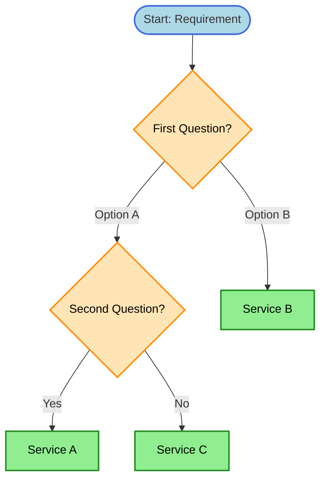

# [Category] Decision Tree

> **Purpose:** [Brief description of what decisions this diagram helps with]

## Decision Flowchart

## Keyword → Service Mapping

| Keywords / Signals | AWS Service | Reasoning |
|--------------------|-------------|-----------|
| keyword1, keyword2 | Service A | Why this service fits |
| keyword3 | Service B | Why this service fits |

## Elimination Rules

| Never Choose | When | Because |
|--------------|------|---------|
| Service X | [Condition] | [Reason] |
| Service Y | [Condition] | [Reason] |

## Cost Comparison

| Service | Pricing Model | Best For |
|---------|---------------|----------|
| Service A | Pay-per-use | Variable workloads |
| Service B | Provisioned | Predictable workloads |

## Trade-off Matrix

| Aspect | Service A | Service B | Service C |
|--------|-----------|-----------|-----------|
| Cost | Low | Medium | High |
| Latency | Medium | Low | Very Low |
| Scalability | High | Medium | Low |
| Ops Overhead | None | Low | High |

## Real-World Scenarios

### Scenario 1: [Name]
**Requirement:** [Description]
**Decision:** [Service chosen]
**Reasoning:** [Why]

### Scenario 2: [Name]
**Requirement:** [Description]
**Decision:** [Service chosen]
**Reasoning:** [Why]

## Common Mistakes

1. **Mistake:** [Description]
   **Correct approach:** [Solution]

2. **Mistake:** [Description]
   **Correct approach:** [Solution]

## Related Decisions

- [Link to related diagram 1](./related-decisions.md)
- [Link to related diagram 2](./other-decisions.md)

---

## References

- [AWS Documentation](https://docs.aws.amazon.com/)
- [Well-Architected Framework](https://aws.amazon.com/architecture/well-architected/)
