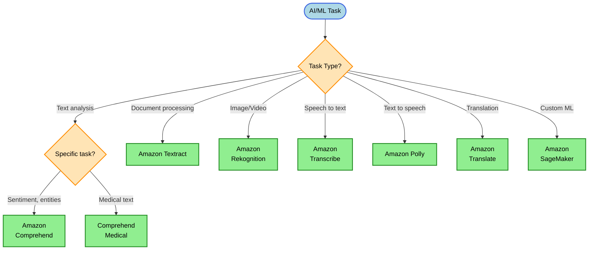
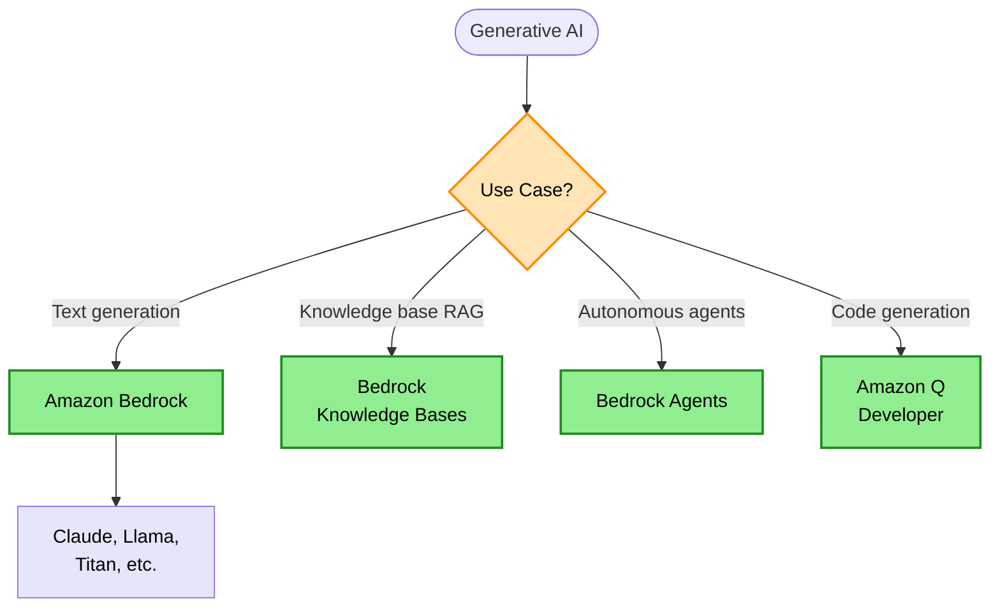
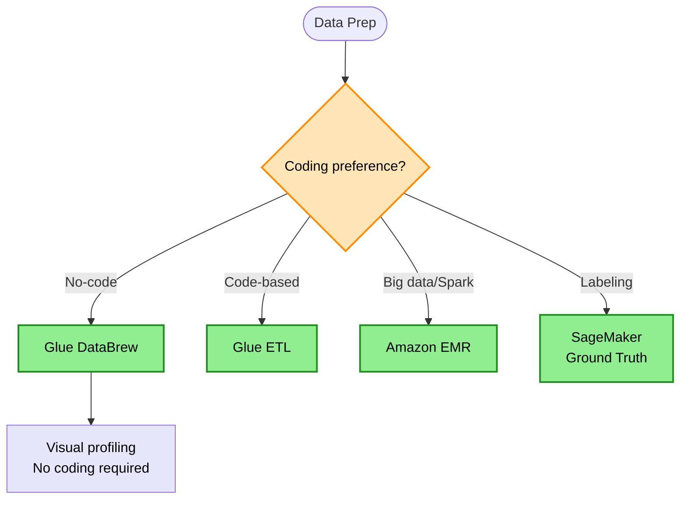

# AI & ML Services Decision Tree

> **Purpose:** Choose the right AWS AI/ML service based on the task type, ML expertise level, and customization needs.

## AI Service Decision (No ML Expertise)

## Generative AI Decision

## Data Preparation Decision

## Keyword → Service Mapping

| Keywords / Signals | AWS Service | Reasoning |
|--------------------|-------------|-----------|
| sentiment, entities, key phrases | Comprehend | NLP without ML team |
| PDF, document extraction | Textract | OCR + form extraction |
| face detection, object detection | Rekognition | Computer vision |
| audio transcription | Transcribe | Speech to text |
| text to audio | Polly | Text to speech |
| language translation | Translate | Multi-language |
| custom ML model | SageMaker | Full ML lifecycle |
| no-code data prep | Glue DataBrew | Visual profiling |
| data labeling | SageMaker Ground Truth | Human + ML labeling |
| generative AI | Bedrock | Foundation models |
| RAG, knowledge search | Bedrock Knowledge Bases | Retrieval-augmented |

## Elimination Rules

| Never Choose | When | Because |
|--------------|------|---------|
| SageMaker | Simple NLP tasks | Use Comprehend instead |
| Custom ML | Pre-built API exists | Over-engineered |
| Rekognition | Document text | Use Textract for documents |
| Comprehend | Image analysis | Comprehend is text only |

## AI Services Comparison (No ML Required)

| Task | AWS Service | Input | Output |
|------|-------------|-------|--------|
| Text sentiment | Comprehend | Text | Sentiment score |
| Entity extraction | Comprehend | Text | Entities (people, places) |
| Document OCR | Textract | PDF/Image | Extracted text |
| Form extraction | Textract | Forms | Key-value pairs |
| Face detection | Rekognition | Image/Video | Face data |
| Object detection | Rekognition | Image/Video | Labels |
| Speech to text | Transcribe | Audio | Text transcript |
| Text to speech | Polly | Text | Audio |
| Translation | Translate | Text | Translated text |

## SageMaker Components

| Component | Purpose |
|-----------|---------|
| Studio | IDE for ML development |
| Training | Train custom models |
| Endpoints | Host models for inference |
| Pipelines | ML workflow automation |
| Ground Truth | Data labeling |
| Feature Store | Feature management |
| Model Registry | Model versioning |

## Bedrock vs SageMaker

| Aspect | Bedrock | SageMaker |
|--------|---------|-----------|
| Use Case | Foundation models, GenAI | Custom ML models |
| ML Expertise | Low | High |
| Customization | Fine-tuning | Full control |
| Models | Pre-trained (Claude, Llama, Titan) | Train your own |
| Pricing | Per token/request | Per compute time |

## Trade-off Matrix

| Service | ML Expertise | Customization | Time to Deploy |
|---------|--------------|---------------|----------------|
| Comprehend | None | Low | Minutes |
| Rekognition | None | Low | Minutes |
| Bedrock | Low | Medium | Hours |
| SageMaker | High | High | Days-Weeks |

## Real-World Scenarios

### Scenario 1: Customer Review Sentiment
**Requirement:** Analyze product review sentiment
**Decision:** Amazon Comprehend
**Reasoning:** Pre-built NLP, no ML expertise needed

### Scenario 2: Invoice Processing
**Requirement:** Extract data from scanned invoices
**Decision:** Amazon Textract
**Reasoning:** OCR + form extraction for documents

### Scenario 3: Content Moderation
**Requirement:** Detect inappropriate images
**Decision:** Amazon Rekognition
**Reasoning:** Pre-built content moderation

### Scenario 4: Call Center Transcription
**Requirement:** Transcribe customer calls
**Decision:** Amazon Transcribe
**Reasoning:** Speech to text with speaker diarization

### Scenario 5: Chatbot with Knowledge Base
**Requirement:** Build RAG-powered chatbot
**Decision:** Bedrock + Knowledge Bases
**Reasoning:** Foundation models + retrieval

### Scenario 6: Custom Fraud Detection
**Requirement:** Build custom fraud model
**Decision:** SageMaker
**Reasoning:** Need custom model training

### Scenario 7: No-Code Data Profiling
**Requirement:** Analysts need to clean data without coding
**Decision:** Glue DataBrew
**Reasoning:** Visual interface, no coding

## API Anomaly Detection

| Requirement | Solution |
|-------------|----------|
| Detect unusual API calls | CloudTrail + CloudWatch metric filter + alarm + SNS |
| Real-time threat detection | GuardDuty |

> **Rule:** API anomaly detection → CloudTrail + CloudWatch metric filter

## Common Mistakes

1. **Mistake:** Building custom NLP for sentiment
   **Correct approach:** Use Comprehend for standard NLP tasks

2. **Mistake:** Using Rekognition for document text
   **Correct approach:** Use Textract for document extraction

3. **Mistake:** SageMaker for simple classification
   **Correct approach:** Use pre-built AI services first

4. **Mistake:** Ignoring Bedrock for GenAI
   **Correct approach:** Bedrock provides managed foundation models

5. **Mistake:** Manual data labeling at scale
   **Correct approach:** Use SageMaker Ground Truth

## ML Pipeline Best Practices

| Stage | AWS Service |
|-------|-------------|
| Data Ingestion | S3, Kinesis |
| Data Prep | Glue, DataBrew |
| Feature Store | SageMaker Feature Store |
| Training | SageMaker Training |
| Validation | SageMaker Model Monitor |
| Deployment | SageMaker Endpoints |
| Monitoring | CloudWatch |

## Related Decisions

- [Analytics Decisions](./analytics-decisions.md) - Data preparation
- [Compute Decisions](./compute-decisions.md) - Training compute
- [Storage Decisions](./storage-decisions.md) - ML data storage

---

## Quick Reference

1. **Text NLP without ML** → Comprehend
2. **Document extraction** → Textract
3. **Image/video analysis** → Rekognition
4. **Speech to text** → Transcribe
5. **Text to speech** → Polly
6. **Translation** → Translate
7. **No-code data prep** → Glue DataBrew
8. **Custom ML models** → SageMaker
9. **Generative AI** → Bedrock
10. **RAG/Knowledge search** → Bedrock Knowledge Bases
11. **Data labeling** → SageMaker Ground Truth
12. **API anomaly detection** → CloudTrail + CloudWatch
