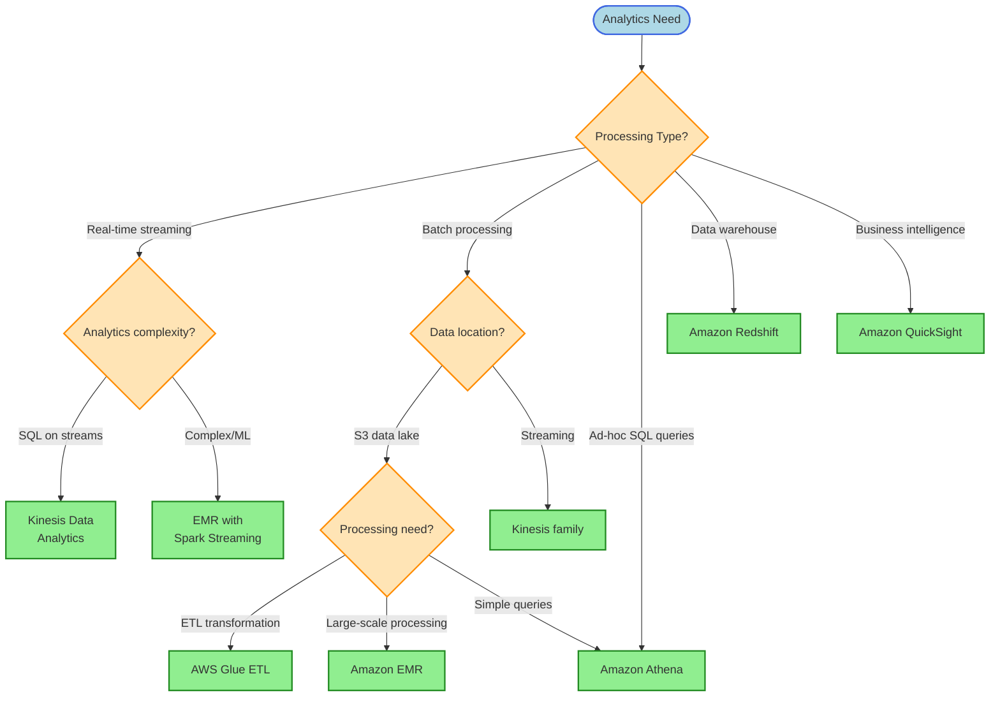
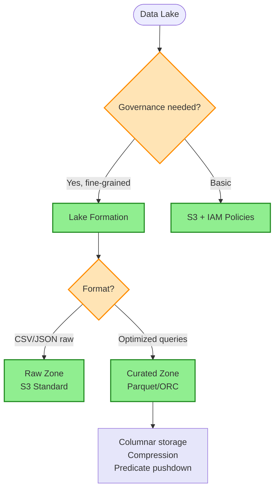
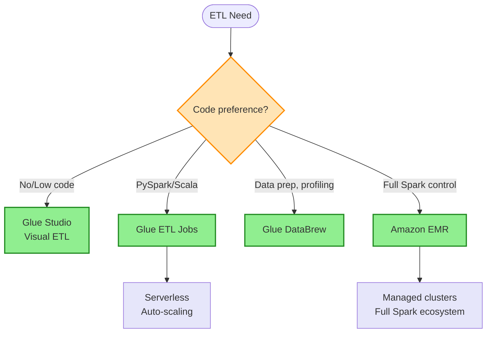

# Analytics Decision Tree

> **Purpose:** Choose the right AWS analytics service based on data processing patterns, latency requirements, query complexity, and operational needs.

## Analytics Service Decision

## Data Lake Architecture Decision

## ETL Service Decision

## Keyword → Service Mapping

| Keywords / Signals | AWS Service | Reasoning |
|--------------------|-------------|-----------|
| ad-hoc SQL on S3 | Athena | Serverless, pay per query |
| data warehouse, complex joins | Redshift | MPP, optimized for analytics |
| real-time streaming SQL | Kinesis Data Analytics | SQL on streams |
| ETL, serverless | Glue | Managed Spark |
| large-scale Spark/Hadoop | EMR | Full cluster control |
| BI dashboards | QuickSight | Managed BI |
| no-code data prep | Glue DataBrew | Visual profiling |
| data lake governance | Lake Formation | Fine-grained access |

## Elimination Rules

| Never Choose | When | Because |
|--------------|------|---------|
| Athena | Need joins across data sources | Limited federation |
| Redshift | Simple S3 queries | Over-engineered |
| EMR | Simple ETL jobs | Use Glue instead |
| Kinesis Analytics | Batch processing | It's for streams |
| QuickSight | Real-time dashboards | Has refresh delays |

## Athena vs Redshift vs EMR

| Aspect | Athena | Redshift | EMR |
|--------|--------|----------|-----|
| Use Case | Ad-hoc S3 queries | Data warehouse | Big data processing |
| Pricing | Per TB scanned | Per node hour | Per node hour |
| Setup | None | Provision cluster | Provision cluster |
| Performance | Good | Excellent | Excellent |
| Best For | Occasional queries | Heavy analytics | Complex processing |

## Data Format Comparison

| Format | Type | Compression | Query Speed | Use Case |
|--------|------|-------------|-------------|----------|
| CSV | Row | Poor | Slow | Raw ingestion |
| JSON | Row | Poor | Slow | Semi-structured |
| Parquet | Column | Excellent | Fast | Analytics |
| ORC | Column | Excellent | Fast | Hive workloads |
| Avro | Row | Good | Medium | Streaming |

> **Key Insight:** JSON → Parquet = 6x storage reduction, 2x faster queries

## Cost Comparison

| Service | Pricing Model | Cost Efficiency |
|---------|---------------|-----------------|
| Athena | $5 per TB scanned | Best for occasional |
| Redshift | Per node hour | Best for heavy use |
| EMR | Per node hour + EC2 | Flexible |
| Glue | Per DPU hour | Serverless |
| QuickSight | Per user/month | Predictable |

## Trade-off Matrix

| Aspect | Athena | Redshift | EMR | Glue |
|--------|--------|----------|-----|------|
| Ops | None | Low | Medium | None |
| Latency | Seconds | Sub-second | Seconds | Minutes |
| Scale | Auto | Manual | Manual | Auto |
| Cost (low use) | Low | High | Medium | Low |
| Cost (high use) | High | Low | Low | Medium |

## Real-World Scenarios

### Scenario 1: Ad-Hoc Log Analysis
**Requirement:** Query CloudTrail logs occasionally
**Decision:** Athena
**Reasoning:** Serverless, pay per query, no infrastructure

### Scenario 2: Enterprise Data Warehouse
**Requirement:** Complex BI queries, daily reports
**Decision:** Redshift
**Reasoning:** MPP, optimized for analytics workloads

### Scenario 3: ML Feature Engineering at Scale
**Requirement:** Process TBs of data with Spark MLlib
**Decision:** EMR with Spark
**Reasoning:** Full Spark ecosystem, ML libraries

### Scenario 4: JSON to Parquet ETL
**Requirement:** Transform hourly JSON files to Parquet
**Decision:** Glue ETL
**Reasoning:** Serverless, scheduled, auto-scaling

### Scenario 5: No-Code Data Profiling
**Requirement:** Analysts need to profile and clean data
**Decision:** Glue DataBrew
**Reasoning:** Visual interface, no coding required

### Scenario 6: Real-Time Clickstream Analysis
**Requirement:** Analyze user clicks within seconds
**Decision:** Kinesis Data Analytics
**Reasoning:** SQL on streaming data

### Scenario 7: Data Lake with Fine-Grained Access
**Requirement:** Column-level permissions on S3 data
**Decision:** Lake Formation
**Reasoning:** Built-in governance, access control

## Glue Components

| Component | Purpose |
|-----------|---------|
| Glue Catalog | Metadata store (tables, schemas) |
| Glue Crawlers | Auto-discover schemas |
| Glue ETL | PySpark jobs |
| Glue Studio | Visual ETL builder |
| Glue DataBrew | No-code data prep |

## Athena Optimization Tips

| Technique | Benefit |
|-----------|---------|
| Use Parquet/ORC | 90% less data scanned |
| Partition data | Query specific partitions |
| Use LIMIT | Reduce scanned data |
| Compress | Smaller files = less cost |

## Common Mistakes

1. **Mistake:** Using Athena for heavy, repeated queries
   **Correct approach:** Use Redshift for frequent analytics

2. **Mistake:** Storing data as JSON for analytics
   **Correct approach:** Convert to Parquet for performance

3. **Mistake:** Running EMR for simple ETL
   **Correct approach:** Use Glue for serverless ETL

4. **Mistake:** Kinesis Analytics for batch data
   **Correct approach:** Use Glue or EMR for batch

5. **Mistake:** No partitioning in Athena queries
   **Correct approach:** Partition by date/region for cost savings

## Lake Formation Permission Model

| Traditional | Lake Formation |
|-------------|----------------|
| IAM + S3 bucket policies | Catalog permissions |
| Complex, scattered | Centralized |
| Bucket-level | Table/column level |

## Related Decisions

- [Storage Decisions](./storage-decisions.md) - S3 storage classes
- [Database Decisions](./database-decisions.md) - Data warehouse vs DB
- [Messaging Decisions](./messaging-decisions.md) - Streaming ingestion

---

## Quick Reference

1. **Ad-hoc S3 queries** → Athena
2. **Data warehouse** → Redshift
3. **Big data / Spark** → EMR
4. **Serverless ETL** → Glue
5. **Real-time streaming SQL** → Kinesis Data Analytics
6. **No-code data prep** → DataBrew
7. **Data lake governance** → Lake Formation
8. **JSON → Parquet** = 6x storage, 2x speed improvement
9. **Athena cost** → Pay per TB scanned (use Parquet!)
