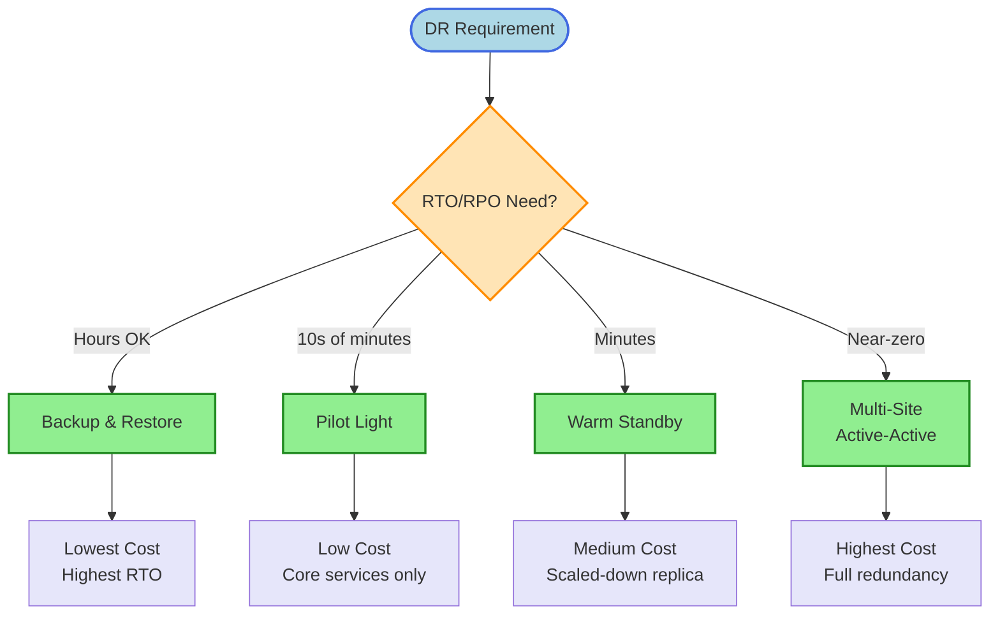
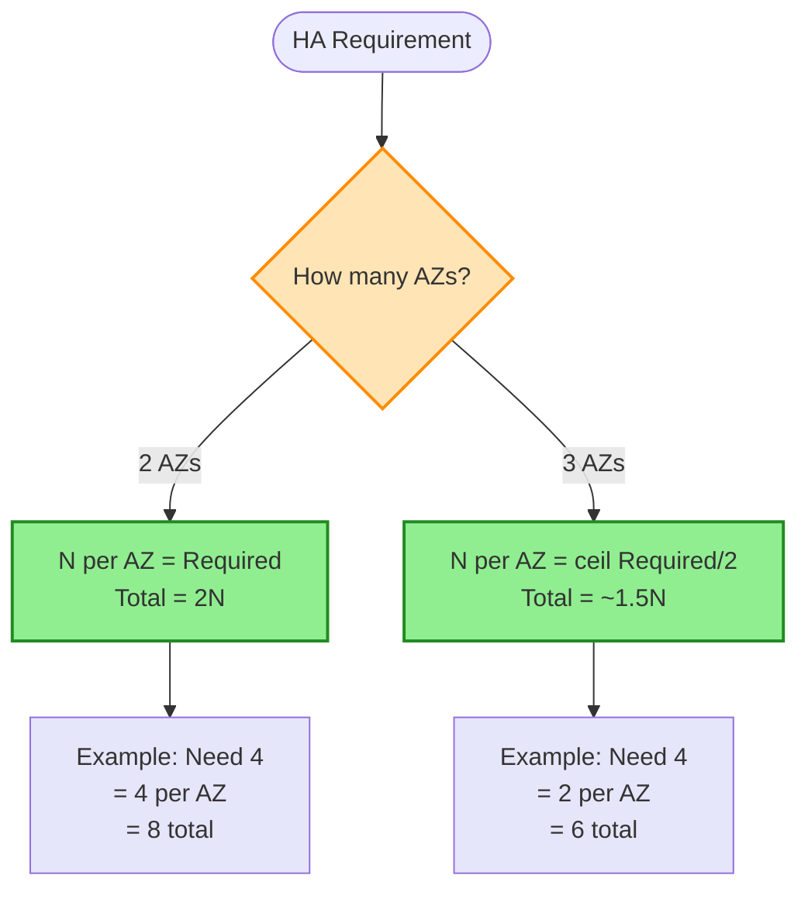
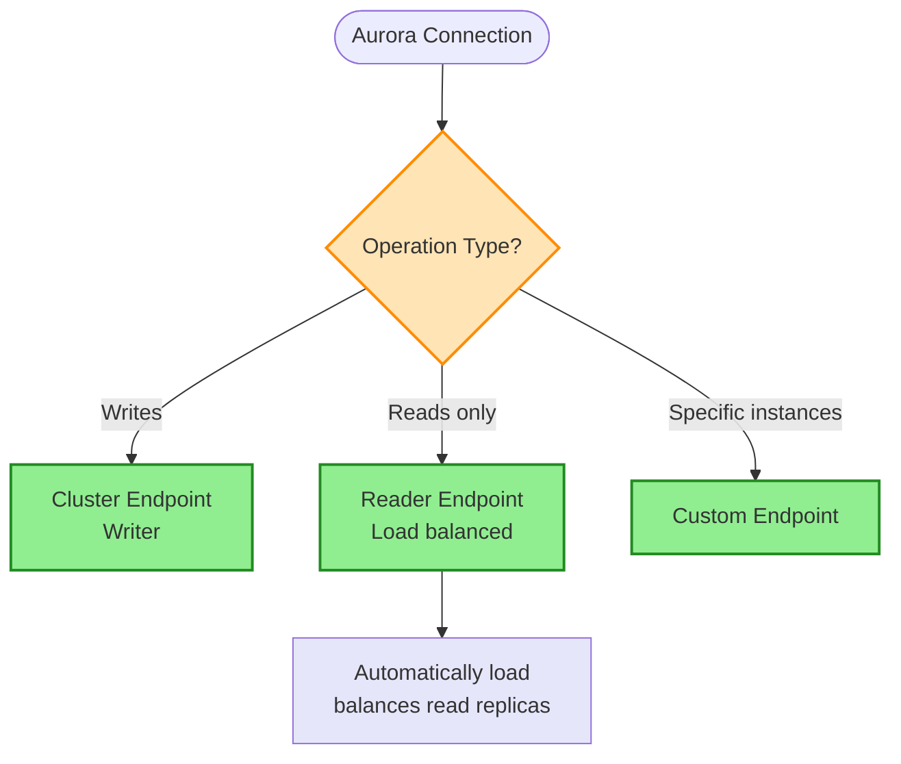

# High Availability Decision Tree

> **Purpose:** Choose the right AWS high availability and disaster recovery patterns based on RTO/RPO requirements, cost constraints, and workload criticality.

## DR Strategy Decision



## Instance Count Calculation



## Aurora Endpoints Decision



## Keyword → Service Mapping

| Keywords / Signals | Strategy/Service | Reasoning |
|--------------------|------------------|-----------|
| lowest cost DR | Backup & Restore | Only storage costs |
| minimal downtime | Warm Standby | Pre-provisioned, scaled-down |
| zero downtime | Active-Active | Full redundancy |
| hybrid DR | Warm Standby + Route 53 failover | Cross-environment |
| global read replicas | Aurora Global Database | RPO ~1s, RTO ~1min |

## Elimination Rules

| Never Choose | When | Because |
|--------------|------|---------|
| Backup & Restore | RTO < 1 hour | Too slow to restore |
| Active-Active | Budget-constrained | Most expensive |
| Pilot Light | Need immediate failover | Still requires scaling |
| Single AZ | Production workloads | No fault tolerance |

## DR Patterns Comparison

| Pattern | RTO | RPO | Cost | Implementation |
|---------|-----|-----|------|----------------|
| Backup & Restore | Hours | Last backup | Lowest | S3, snapshots |
| Pilot Light | 10s of minutes | Near-zero | Low | Core infra running |
| Warm Standby | Minutes | Near-zero | Medium | Scaled-down replica |
| Multi-Site Active-Active | Near-zero | Zero | Highest | Full redundancy |

## Instance Count Formula

| Minimum Required | AZs | Instances per AZ | Total |
|------------------|-----|------------------|-------|
| N instances | 2 | N | 2N |
| N instances | 3 | ceil(N/2) | ~1.5N |

> **Examples:**
> - 4 minimum + 2 AZs = 8 total (4 per AZ)
> - 4 minimum + 3 AZs = 6 total (2 per AZ)
> - More AZs = more efficient

## Aurora Endpoints

| Endpoint | Purpose | Load Balanced |
|----------|---------|---------------|
| Cluster (Writer) | Read + Write | No (single writer) |
| Reader | Read only | Yes (across replicas) |
| Custom | Subset of instances | Configurable |
| Instance | Direct to specific instance | No |

> **Rule:** Separate reads from writes → Use Reader endpoint for reads

## Aurora Global Database

| Metric | Value |
|--------|-------|
| RPO | ~1 second |
| RTO | ~1 minute |
| Replication | Physical, asynchronous |
| Use Case | Global DR, read scaling |

## RDS Multi-AZ vs Read Replicas

| Feature | Multi-AZ | Read Replica |
|---------|----------|--------------|
| Purpose | High availability | Read scaling |
| Replication | Synchronous | Asynchronous |
| Failover | Automatic | Manual promotion |
| Read traffic | No | Yes |
| Cross-region | No | Yes |

> **Rules:**
> - HA requirement → Multi-AZ
> - Read scaling / reporting → Read Replica
> - Engine upgrade = downtime (both AZs upgraded)

## Route 53 Failover Pattern

```
Primary (Active)     Secondary (Passive)
     |                      |
Route 53 Health Check  Route 53 Health Check
     |                      |
     └──── Failover ────────┘
           Routing Policy
```

| Component | Configuration |
|-----------|---------------|
| Primary | Health check enabled |
| Secondary | Failover record |
| TTL | Low (60s recommended) |

## Trade-off Matrix

| Aspect | Backup & Restore | Pilot Light | Warm Standby | Active-Active |
|--------|------------------|-------------|--------------|---------------|
| Cost | Lowest | Low | Medium | Highest |
| RTO | Hours | 10s of min | Minutes | Near-zero |
| RPO | Last backup | Near-zero | Near-zero | Zero |
| Complexity | Low | Medium | Medium | High |
| Ops Overhead | Low | Medium | Medium | High |

## Real-World Scenarios

### Scenario 1: Development Environment DR
**Requirement:** DR for dev, cost is primary concern
**Decision:** Backup & Restore
**Reasoning:** Acceptable to wait hours for recovery

### Scenario 2: Production E-commerce
**Requirement:** Minimal downtime, critical revenue
**Decision:** Warm Standby + Route 53 failover
**Reasoning:** Minutes RTO acceptable, cost-balanced

### Scenario 3: Financial Trading Platform
**Requirement:** Zero downtime tolerance
**Decision:** Multi-Site Active-Active
**Reasoning:** Revenue loss per second justifies cost

### Scenario 4: Global Application
**Requirement:** Low latency reads worldwide + DR
**Decision:** Aurora Global Database
**Reasoning:** RPO ~1s, RTO ~1 min, global read scaling

### Scenario 5: Hybrid DR
**Requirement:** On-prem primary, AWS DR
**Decision:** Warm Standby + Route 53 + Direct Connect/VPN
**Reasoning:** Pre-provisioned AWS, failover routing

### Scenario 6: Database Reporting
**Requirement:** Heavy reports slowing production
**Decision:** Read Replica for reporting
**Reasoning:** Offload reads, protect production

## Common Mistakes

1. **Mistake:** Single AZ for production
   **Correct approach:** Always use Multi-AZ for production

2. **Mistake:** Using Read Replicas for HA
   **Correct approach:** Read Replicas are for scaling, not HA (use Multi-AZ)

3. **Mistake:** High TTL on failover DNS
   **Correct approach:** Use low TTL (60s) for faster failover

4. **Mistake:** Not testing DR regularly
   **Correct approach:** Regular DR drills, game days

5. **Mistake:** Pilot Light without scale-up automation
   **Correct approach:** Automate scaling during failover

## ASG Behavior for HA

| Scenario | ASG Behavior |
|----------|--------------|
| Instance failure | Launches replacement |
| AZ failure | Rebalances to healthy AZs |
| Health check failure | Terminates and replaces |

> **Rule:** ASG + Multi-AZ = automatic instance-level HA

## CloudFormation StackSets for DR

| Feature | Use Case |
|---------|----------|
| StackSets | Deploy to multiple regions |
| Drift Detection | Ensure DR matches primary |
| Auto-deploy | New accounts get DR infra |

> **Rule:** Multi-account + multi-region deployment → CloudFormation StackSets

## Related Decisions

- [Database Decisions](./database-decisions.md) - Multi-AZ, replicas
- [Networking Decisions](./networking-decisions.md) - Route 53 failover
- [Scaling Decisions](./scaling-decisions.md) - ASG for availability

---

## Quick Reference

1. **Lowest cost DR** → Backup & Restore
2. **Minimal downtime** → Warm Standby
3. **Zero downtime** → Active-Active
4. **HA for RDS** → Multi-AZ (not Read Replicas)
5. **Read scaling** → Read Replicas
6. **Aurora DR reads** → Use Reader endpoint
7. **Aurora Global** → RPO ~1s, RTO ~1 min
8. **Instance count** → N minimum + 2 AZs = 2N total
9. **Hybrid DR** → Warm Standby + Route 53 failover
10. **Multi-region deploy** → CloudFormation StackSets
